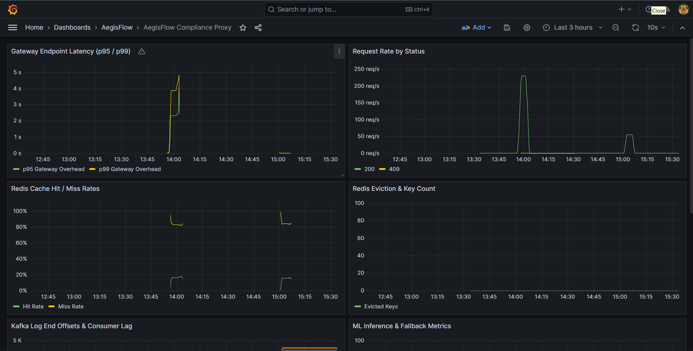
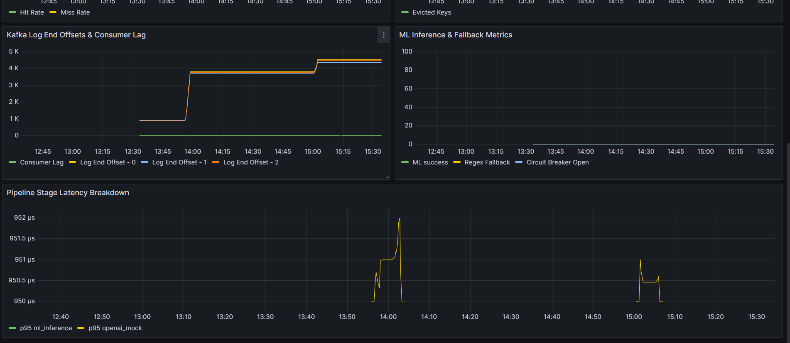

# AegisFlow

**High-throughput, low-latency distributed compliance proxy** that sits between internal corporate applications and third-party LLM providers.

AegisFlow intercepts outgoing prompt traffic, strips or masks PII locally in real-time using lightweight ML, forwards sanitized data to the cloud LLM, and transparently rehydrates the model's response before returning it to the user. All transactional metadata is archived via an asynchronous Kafka pipeline for SOC 2 compliant audit trails.

## Architecture

Synchronous hot path (per request) and asynchronous audit path:

```
                         [ Corporate Client ]
                                  |
                                  | HTTPS  /v1/chat/completions
                                  v
+---------------------------------------------------------------------+
|                    API Ingestion Gateway (TypeScript)               |
|                                                                     |
|  (1) Auth · Rate-limit · Idempotency ──────────────────> Redis       |
|  (2) Sync PII mask ──────────────────────────────────> ML Inference |
|  (3) Store tx_map ───────────────────────────────────> Redis       |
|  (4) Forward sanitized prompt ───────────────────────> OpenAI API  |
|  (5) Fetch tx_map · Rehydrate response <────────────── Redis       |
|  (6) Return rehydrated response to client                           |
|  (7) Async audit event (fire-and-forget) ────────────> Kafka        |
+---------------------------------------------------------------------+
                                  |
                                  |  (async, decoupled from HTTP loop)
                                  v
                    +---------------------------+
                    |   Compliance Worker (TS)  |
                    |   SHA-256 · batch write   |
                    +-------------+-------------+
                                  v
                             PostgreSQL
                          (audit_events)

Topics: raw-audit-events  |  dlq-compliance-errors (on failure)
```

**Notes:** Redis is not a separate hop in the business logic — the gateway uses it for idempotency, rate limiting, and ephemeral PII mappings (`tx_map:{key}`, 60s TTL). ML Inference is an internal service called only by the gateway. Prometheus and Grafana scrape metrics locally; they are not on the request hot path.

## Tech Stack

| Layer | Technology |
|-------|-----------|
| Ingestion Gateway | Node.js / TypeScript (Fastify) |
| ML Inference | Python / FastAPI (Presidio + Hugging Face NER) |
| Event Streaming | Apache Kafka + Zookeeper |
| Cache / State | Redis |
| Audit Store | PostgreSQL |
| Observability | Prometheus + Grafana |

## Quick Start

### Prerequisites

- Docker & Docker Compose v2
- OpenAI API key optional — **mock mode** activates automatically with placeholder keys

### Launch

```bash
cp .env.example .env
docker compose up -d --build
```

If images are already built and Docker Hub is unreachable:

```bash
docker compose up -d
```

### Verify Services

> **Windows Docker Desktop:** use `127.0.0.1` instead of `localhost` if pages hang or time out.

| Service | URL | Credentials |
|---------|-----|-------------|
| Gateway API | http://127.0.0.1:3000 | `Authorization: Bearer dev-api-key-1` |
| ML Inference | http://127.0.0.1:8000 | — |
| Grafana | http://127.0.0.1:3001 | admin / aegisflow |
| Prometheus | http://127.0.0.1:9090 | — |
| Postgres | localhost:5432 | user `aegisflow`, db `aegisflow_audit` |

### Example Request

```bash
curl -X POST http://127.0.0.1:3000/v1/chat/completions \
  -H "Authorization: Bearer dev-api-key-1" \
  -H "Idempotency-Key: demo-$(date +%s)" \
  -H "Content-Type: application/json" \
  -d '{
    "model": "gpt-4o-mini",
    "messages": [
      {"role": "user", "content": "Contact John Smith at john@example.com or 555-123-4567"}
    ]
  }'
```

### Compliance Mock Mode

If `OPENAI_API_KEY` is missing or still a placeholder, the gateway runs in **Compliance Mock Mode** — the full pipeline executes (mask → Redis → simulated LLM → rehydrate → Kafka audit) without calling OpenAI.

```bash
curl http://127.0.0.1:3000/health
# {"mockMode":true,"piiMaskMode":"ml",...}
```

## Core Features

### Idempotency (Exactly-Once)

Every request requires an `Idempotency-Key` header. The gateway tracks in-flight and completed requests in Redis (60s TTL) to prevent duplicate processing on network retries.

### PII Masking Pipeline

1. Raw prompt sent to ML Inference Engine (Presidio + `elastic/distilbert-base-uncased-finetuned-conll03-english`)
2. Masked text + placeholder mapping returned
3. Mapping stored in Redis (`tx_map:{key}`, 60s TTL)
4. Sanitized prompt forwarded to OpenAI (or mock)
5. Response rehydrated using mapping before client delivery

### Circuit Breaker / Fallback

If ML inference times out or crashes, the gateway falls back to regex-based PII detection. If structural verification fails, the request is blocked with HTTP 503 — unsanitized prompts never pass the perimeter.

### Async Audit Trail

After response dispatch, the gateway emits audit events to Kafka topic `raw-audit-events`. The Compliance Worker consumes events, computes SHA-256 structural signatures, and batch-writes to PostgreSQL table `audit_events`.

Failed consumer processing routes to `dlq-compliance-errors` with exception headers.

Verify audit data:

```bash
docker compose exec postgres psql -U aegisflow -d aegisflow_audit \
  -c "SELECT transaction_id, idempotency_key, created_at FROM audit_events ORDER BY created_at DESC LIMIT 5;"
```

## Observability

Open Grafana at **http://127.0.0.1:3001** → **Dashboards → AegisFlow → AegisFlow Compliance Proxy**.

The dashboard tracks:

- **p95 / p99 Gateway Latency** — internal overhead target < 25ms
- **Request Rate by Status** — throughput and error codes
- **Redis Cache Hit/Miss Rates** and eviction metrics
- **Kafka Log End Offsets & Consumer Lag** — background worker health
- **ML Inference & Fallback Metrics** — circuit breaker visibility
- **Pipeline Stage Latency Breakdown** — Redis, ML, OpenAI/mock, rehydration

### Grafana Dashboard (Live)

Gateway throughput, latency, and Redis metrics during a stress-test run:



Kafka offsets, consumer lag, ML inference metrics, and pipeline stage latency:



## Stress Benchmarks

### Artillery (recommended)

```bash
./benchmarks/run-benchmark.sh
```

| Profile | Command | Target |
|---------|---------|--------|
| Local (default) | `./benchmarks/run-benchmark.sh` | ~200 rps, laptop-friendly |
| Full PRD | `STRESS_PROFILE=full ./benchmarks/run-benchmark.sh` | up to 5,000 rps |

Reports are written to `benchmarks/results/report.json` and `report.html`.

The script applies benchmark-friendly gateway settings (`PII_MASK_MODE=regex`, `MOCK_LLM_DELAY_MS=0`) and runs Artillery inside Docker when Windows host port forwarding is unavailable.

### Locust

```bash
pip install locust
locust -f benchmarks/locust/locustfile.py --host=http://127.0.0.1:3000 \
       --headless -u 5000 -r 500 --run-time 5m \
       --csv=benchmarks/results/locust_report
```

### Performance Results (Local Profile @ 200 rps)

Measured with `./benchmarks/run-benchmark.sh` (Artillery, 0 failures):

| Metric | Target | Result |
|--------|--------|--------|
| p95 Internal Overhead | < 25ms | **4 ms** ✓ |
| p99 Internal Overhead | < 50ms | **7 ms** ✓ |
| Sustained Throughput | — | **200 rps** (local profile) |
| Error Rate | < 0.1% | **0%** |

Workload mix: ~70% `/health`, ~15% `/metrics`, ~15% `/v1/chat/completions` (with mock PII).

## Production Deployment Architecture (AWS)

The `docker-compose` stack is for **local validation and benchmarking**. Production maps each service to managed AWS components while keeping the same logical flow as the diagram above.

```
                    [ Route 53 + ACM TLS ]
                              |
                              v
                   Application Load Balancer
                              |
              +---------------+---------------+
              |                               |
              v                               v
     ECS/Fargate Service              ECS/Fargate Service
     (gateway — TypeScript)          (ml-inference — Python)
     public via ALB                  internal only (Service Connect / Cloud Map)
              |                               ^
              |         VPC private subnets   |
              +-------+-------+-------+-------+
                      |       |       |
                      v       v       v
              ElastiCache   MSK     RDS PostgreSQL
              (Redis)     (Kafka)   (Multi-AZ audit)
                      |
                      v
              ECS/Fargate Service
              (compliance-worker — TypeScript)
                      |
                      v
                 RDS PostgreSQL

Observability: Amazon Managed Prometheus + Amazon Grafana (or CloudWatch Container Insights)
Secrets: AWS Secrets Manager (OPENAI_API_KEY, API_KEYS, DB credentials)
```

| Local (compose) | AWS (production) | Role |
|-----------------|------------------|------|
| `gateway` | **ECS Fargate** or **EKS** behind **ALB** | Public ingestion, orchestration, mock/LLM forwarding |
| `ml-inference` | **ECS Fargate** (CPU/GPU task) | Internal-only PII masking; scale independently of gateway |
| `compliance-worker` | **ECS Fargate** or **EKS** Deployment | Kafka consumer → RDS; scale on consumer lag |
| Kafka + Zookeeper | **Amazon MSK** | `raw-audit-events`, `dlq-compliance-errors`; multi-AZ |
| Redis | **Amazon ElastiCache (Redis)** | Idempotency, rate limits, `tx_map` TTL state |
| PostgreSQL | **Amazon RDS (PostgreSQL)** Multi-AZ | Immutable `audit_events` / `dlq_events` |
| Prometheus + Grafana | **AMP + AMG** or **CloudWatch** | Dashboards, p95/p99, Kafka lag, Redis hit rate |
| `.env` secrets | **Secrets Manager** + task IAM roles | No keys in images or task definitions |

**Scaling guidance:** Autoscale gateway tasks on ALB request count / CPU; scale ML tasks on mask latency or queue depth; scale compliance workers on MSK consumer lag (`compliance-worker-group`). MSK and ElastiCache should be multi-AZ. RDS uses automated backups and encryption at rest for SOC 2 retention requirements.

## Project Structure

```
AegisFlow/
├── gateway/                 # TypeScript API Ingestion Gateway
├── ml-inference/            # Python FastAPI PII masking engine
├── compliance-worker/       # TypeScript Kafka consumer → PostgreSQL
├── infrastructure/          # Postgres, Prometheus, Grafana configs
├── benchmarks/              # Artillery + Locust stress tests
├── docs/                    # Screenshots and documentation assets
└── docker-compose.yml       # Full stack orchestration
```

## License

MIT
